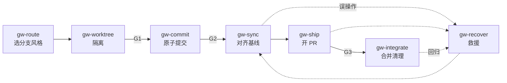
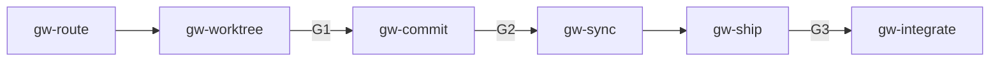
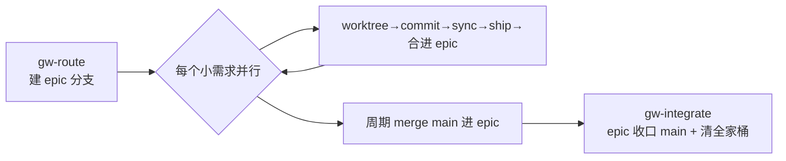

# git-workflow

> 把通用 Git 工作流从"靠老手的肌肉记忆"变成"Agent 可重复执行、可门禁、可回溯"的开发工序插件。

一套面向 Claude Code 与 Cowork 的 Git 工序集:覆盖**分支模型决策、worktree 隔离、原子提交与 Conventional Commits、基线同步、PR 交付、合并清理、误操作救援**。核心特色是给每一步 git 状态变更标上 **risk 安全分级**(safe / caution / danger),让"会改写历史、会动远端"的危险操作有门禁、可回溯。

---

## 它解决什么问题

分支怎么切、提交怎么写、worktree 怎么隔离、rebase 还是 merge、误删了怎么救——这些 git 纪律高度依赖经验,难标准化、难交接、更难让 Agent 稳定复现,还动不动就改坏共享历史。

本插件把这套纪律固化成一串带**退出门禁**与**风险分级**的结构化工序:

- 每一站都有明确的 **输入 / 流程 / 产出 / 校验清单 / 回溯触发**;
- 上一站的产出(路由单、提交序列、对齐状态)**直接当作**下一站输入;
- 校验不过则按**回溯矩阵**退回对应上游;
- **危险操作(改写历史 / 动共享分支 / force-push)被 `danger` 分级拦下**,强制停下确认并优先可逆形式。

> **核心一句话**:每个 Skill = 一段面向 LLM 的、带退出门禁与风险分级的 git SOP——不是被动检索的命令手册,而是主动执行的"交付工序"。

---

## 核心机制:risk 安全分级（本插件命脉)

git 与纯分析类工作最大的不同是它**改状态、且部分操作不可逆**。所以每个 Skill 在 frontmatter 标 `risk`,贯穿全流程守护:

| 级别 | 含义 | 纪律 | 典型操作 |
| :--- | :--- | :--- | :--- |
| `safe` | 只读 / 决策 | 直接做 | 路由、看 diff、reflog 定位 |
| `caution` | 改本地、可逆 | 做完报告 | 原子提交、建 worktree、私有分支 rebase |
| `danger` | 改写历史 / 动远端 / 动共享分支 | **停下确认 + 优先可逆形式** | force-push、合入主线、`reset --hard`、清密钥史 |

配套贯穿全体系的**私有 vs 共享分支**安全轴:私有分支可自由 rebase/改写;共享分支(`main`/`epic/*`/`develop`/多人推送)**绝不改写历史**,撤销只用 `revert`。这条轴决定了 `gw-sync`(rebase vs merge)与 `gw-recover`(reset vs revert)的全部行为。

---

## 工作原理

### 三层架构

| 层 | 是什么 | 放在哪 |
| :--- | :--- | :--- |
| **SKILL** | 原子工序(一段 git 操作 + 一份结构化产出)——交付链路的积木 | `skills/*/SKILL.md` |
| **COMMAND** | 薄入口(斜杠命令,带参数)——一键触发某站或整条链路 | `commands/*.md` |
| **WORKFLOW** | 编排(按门禁串联多站,含回溯)——承载三种驱动的完整链路 | `workflows/*.md` |

### 交付流水线（一次变更的生命周期)



### 七个 Skill（按阶段)

| 阶段 | Skill | risk | 职责 |
| :--- | :--- | :--- | :--- |
| route 路由 | `gw-route` | safe | 选分支风格、定基线/PR 目标/隔离、标私有·共享 |
| isolate 隔离 | `gw-worktree` | caution | worktree 建/列/安全清理,并行 Agent 隔离 |
| commit 提交 | `gw-commit` | caution | 原子提交 + Conventional Commits + 提交前扫描 |
| sync 同步 | `gw-sync` | caution→danger | 按可见性 rebase/merge、冲突纪律、force-with-lease |
| ship 交付 | `gw-ship` | caution | 推送 + 开 PR(平台无关)、承接提交写正文 |
| integrate 整合 | `gw-integrate` | danger | 合并策略 + epic 收口 + 打 tag + 清理全家桶 |
| recover 救援 | `gw-recover` | caution→danger | reflog/revert/reset 找回与撤销,泄密处置 |

---

## 分支模型菜单（gw-route 是选择器,不锁死)

`gw-route` 按环境从菜单里选一种并与用户确认:

| 风格 | feature 基线 | PR 目标 | 最适合 |
| :--- | :--- | :--- | :--- |
| **Trunk-Based / GitHub Flow**(缺省默认) | `main` | `main` | CI/CD、小步合并、并行 worktree |
| **Epic 集成分支** | `epic/<name>` | `epic/<name>` | **大需求拆多小需求、多人/多 Agent 并行** |
| **Git Flow** | `develop` | `develop` | 定期发版、多版本维护 |
| **Feature Flags on trunk** | `main` | `main`(藏开关后) | 强 CI + 开关基建 |
| **共享分支** | 共享分支本身 | 直接 push | 临时 2-3 人 |
| **Stacked PR** | 上一层分支 | 自底向上 | 单人依赖链 |

> Epic 集成分支 = `master → feature → dev → master` 直觉的正确形态:`dev` 不是永久 `develop`,而是**每个大需求一条、用完即删**的集成分支。完整取舍见 [`references/branching-models.md`](references/branching-models.md)。

---

## 三条 Workflow

### A. Deliver（标准交付,主链路)



普通变更端到端:路由 → 隔离 → 原子提交 → 同步 → PR → 合并清理。三道强门禁 G1/G2/G3,详见 [`workflows/workflow-deliver.md`](workflows/workflow-deliver.md)。

### B. Epic（大需求并行)



每个小需求各自分支 → PR 进 epic 集成分支 → epic 整体收口 main。多人不踩同一分支,各自历史干净。详见 [`workflows/workflow-epic.md`](workflows/workflow-epic.md)。

### C. Hotfix（紧急生产修复)

基线是**生产发布点**而非最新 main;最小修复 → patch tag → **回灌(back-merge)** 到日常基线。详见 [`workflows/workflow-hotfix.md`](workflows/workflow-hotfix.md)。

---

## 命令清单

| 命令 | 作用 |
| :--- | :--- |
| `/git-workflow:commit [范围]` | 把工作区改动整理成原子提交 + Conventional Commits |
| `/git-workflow:worktree <分支> [--epic <name>]` | 建/列/清 worktree,隔离并行工作 |
| `/git-workflow:ship <工作描述> [--epic <name>]` | 端到端交付:路由 → 隔离 → 提交 → 同步 → PR → 合并清理 |

---

## 命名空间约定

- Skill 完整调用名:`git-workflow:gw-<skill>`(如 `git-workflow:gw-commit`)。
- 命令:`/git-workflow:<command>`(如 `/git-workflow:ship`)。
- Skill/命令/workflow 引用插件内文件用 `${CLAUDE_PLUGIN_ROOT}/...`(如 `${CLAUDE_PLUGIN_ROOT}/references/branching-models.md`)。

---

## 工程约定

### 统一 `SKILL.md` 接口契约

每个 `gw-*` 的 `SKILL.md` 遵守同一契约,这是"工件可衔接、可门禁"的命脉。frontmatter:

```yaml
---
name: gw-<skill-name>
description: "<一句话:做什么 + 何时触发>"
risk: <safe|caution|danger>
stage: <route|isolate|commit|sync|ship|integrate|recover>
scope: <local|remote>
source: self
tags: "[git, <stage>, <focus>]"
---
```

正文固定七段(顺序固定):**使用时机 / 输入要求 / 流程 / 输出 / 校验清单 / 回溯触发 / 示例**。所有 Skill 都守此契约,上一阶段产出就能直接喂进下一阶段。

### 目录结构

```
git-workflow/
├── .claude-plugin/plugin.json     插件清单
├── README.md                      本文(体系蓝图、流程图、risk 分级)
├── skills/                        7 个 Skill(七段契约 + risk 分级)
│   ├── gw-route/  gw-worktree/  gw-commit/  gw-sync/
│   └── gw-ship/   gw-integrate/ gw-recover/
├── commands/                      3 个斜杠命令(commit / worktree / ship)
├── workflows/                     3 条 workflow(deliver / epic / hotfix)
└── references/
    ├── branching-models.md        分支模型菜单(选择器依据)
    ├── commit-conventions.md      Conventional Commits 完整规范
    ├── worktree-patterns.md       worktree 布局 / 并行 / 陷阱 / 清理
    ├── platform-adapters.md       GitHub / GitLab / Bitbucket / 裸远端
    └── recovery-cookbook.md       reflog / reset / revert / cherry-pick 食谱
```

---

## 安装（Claude Code / Cowork)

这是一个标准插件。安装方式任选其一:

- **marketplace**:从 Keystone 插件市场安装 `git-workflow`。
- **打包安装**:`pwsh ./scripts/pack.ps1` 生成 `dist/git-workflow-<version>.zip`,在 Cowork 导入。
- **本地放置**:把整个插件目录放入 Claude Code 的 plugins 目录,确保 `.claude-plugin/plugin.json` 在根。

安装后调用:

```
/git-workflow:ship 给订单加导出 CSV
/git-workflow:ship 优惠券抵扣 --epic checkout
/git-workflow:worktree feature/order-export
/git-workflow:commit
```

---

## 设计取舍

- **risk 分级是一等公民**:git 改状态、部分不可逆,故把"安全"做进 frontmatter 与门禁,而非靠提醒。`danger` 必停下确认、优先可逆形式。
- **私有/共享分支贯穿全程**:一条安全轴统一决定 rebase vs merge、reset vs revert,杜绝"改写共享历史"这一最常见事故。
- **多风格选择器,不传教**:Trunk-Based 为默认,但 Epic/Git Flow/Flags/Stacked 全部成文,由 `gw-route` 按环境选——尤其把"大需求多小需求并行"做成一等场景(Epic 集成分支)。
- **平台无关**:核心 git 操作与平台脱钩,只有开/合 PR 这步做适配(GitHub/GitLab/Bitbucket/裸远端)。
- **SKILL / COMMAND / WORKFLOW 三层各司其职**,与同市场的 `domain-driven-design`、`consistent-frontend` 同构。
